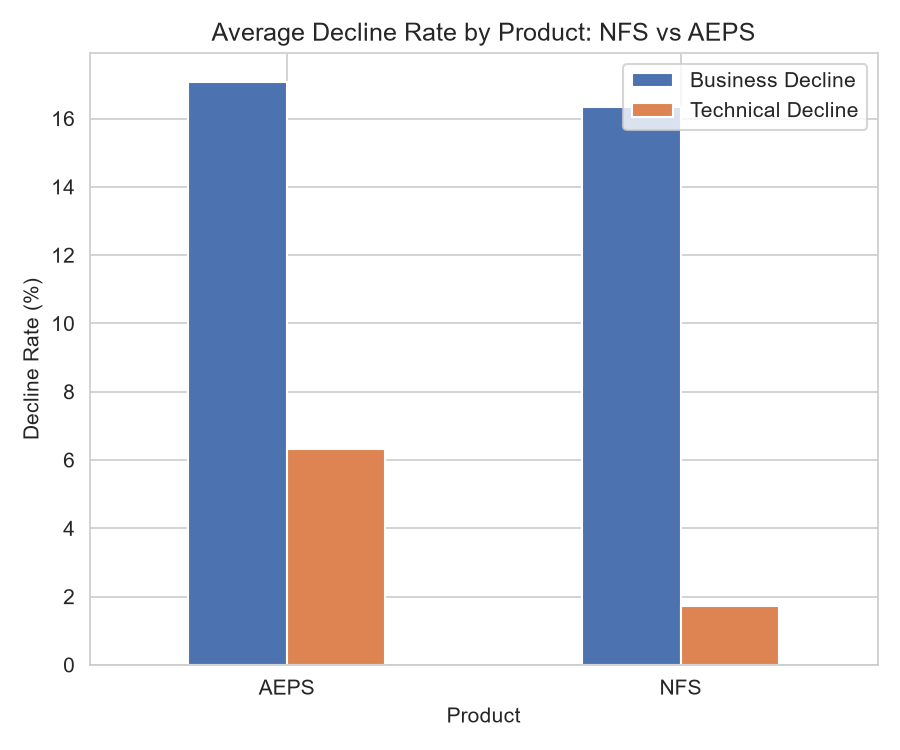
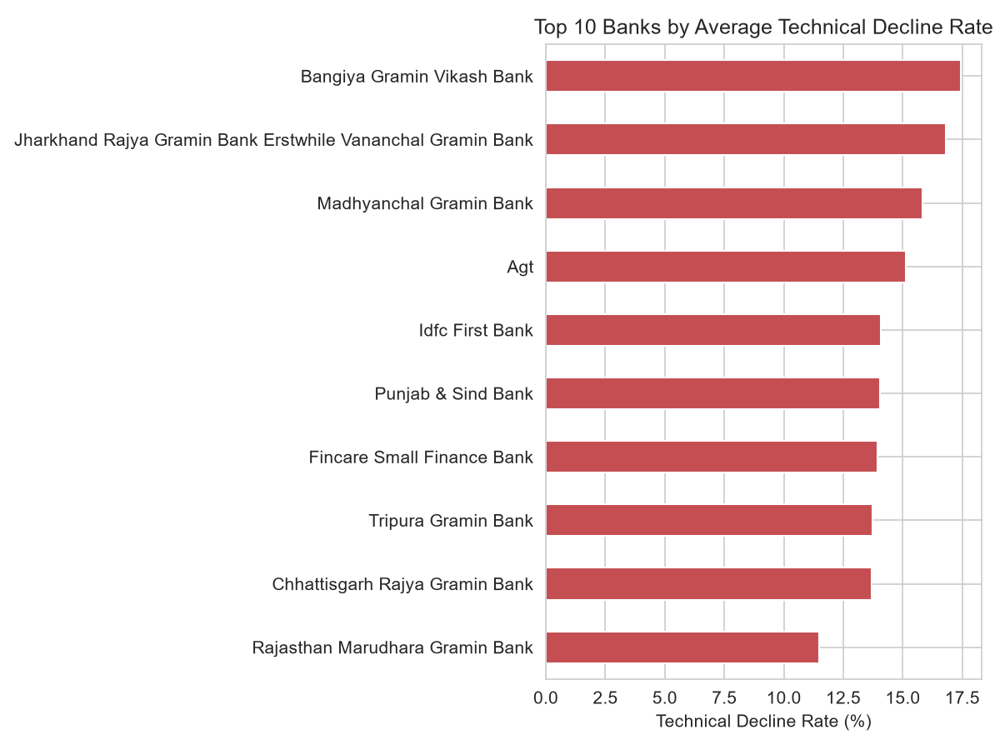
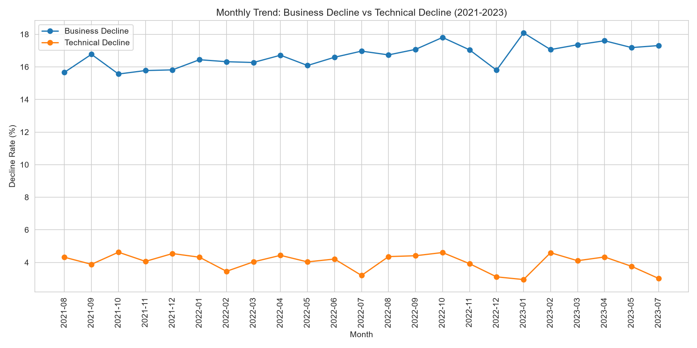
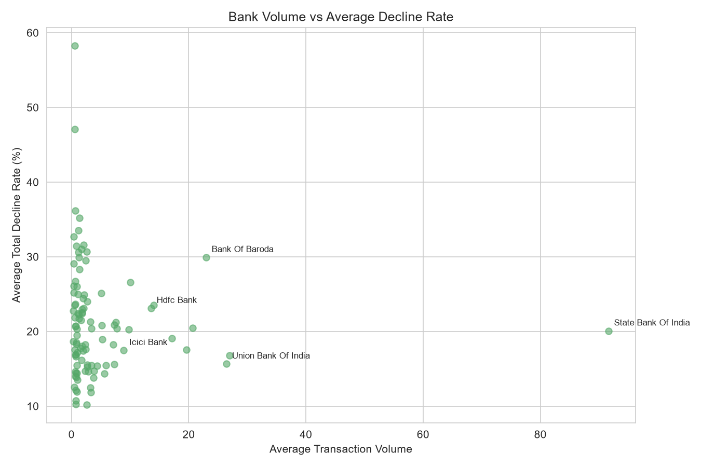

# NPCI Digital Payments Failure Analysis

## Overview
An EDA project investigating why digital payment transactions fail across 
India's NPCI-operated NFS (ATM network) and AEPS (Aadhaar-enabled payments) 
systems — separating technical infrastructure failures from business/user 
declines — across 107 banks, August 2021 to July 2023.

## Tools
Python (pandas, matplotlib, seaborn) · SQL (SQLite) · Jupyter

## Data Source
[India Data Portal – NPCI Product Wise Declined Transactions](https://ckandev.indiadataportal.com/dataset/national-payments-corporation-of-india-npci/resource/f8c33592-34cd-4bdf-b4b8-d845d67b4eb4) 
(free, public). Originally scoped for UPI-specific data — see 
[`NOTES.md`](NOTES.md) for why that pivoted to NFS/AEPS.

## Key Findings

**1. AEPS fails far more than NFS, driven by technical issues**
AEPS's technical decline rate (6.31%) is over 3.6x higher than NFS's 
(1.72%) — likely due to biometric authentication over rural network 
infrastructure vs NFS's more mature ATM network.



**2. Regional Rural Banks dominate technical failures**
The highest technical-decline banks are almost entirely Regional Rural 
Banks, pointing to a real infrastructure gap versus large national banks.



**3. Business decline is rising while technical decline falls**
2021→2023: technical decline dropped (~4.3% → ~3%) while business decline 
rose (~15.7% → ~17.3%) — infrastructure is improving, but user-side 
friction isn't.



**4. Volume doesn't guarantee reliability**
State Bank of India processes the most volume by far but sits at a 
middling ~20% decline rate. The worst outliers (50%+ decline) are all 
low-volume banks.



## Data Quality Issues Found & Fixed
- **Date encoding bug**: the source stored the real month number in the 
  "day" field (e.g. "2022-01-05" meant May 2022, not Jan 5th) — caught by 
  validating unique date counts before trusting any time trend.
- **Inconsistent bank names**: casing, punctuation, and corrupted 
  characters split single banks into multiple entries — resolved via 
  standardization rules + a small alias map.

## Project Structure

```text
NPCI-Digital-Payments-Failure-Analysis/
├── data/
│   ├── raw/         # raw CSV (not tracked)
│   └── processed/   # cleaned data + chart images
├── notebooks/
│   └── eda.ipynb    # full analysis with narrative
├── sql/             # business-question queries + runner
├── src/             # acquisition, validation, cleaning, loading scripts
├── FINDINGS.md      # detailed findings write-up
├── NOTES.md         # data source decision log
└── requirements.txt

## Status
✅ Complete
